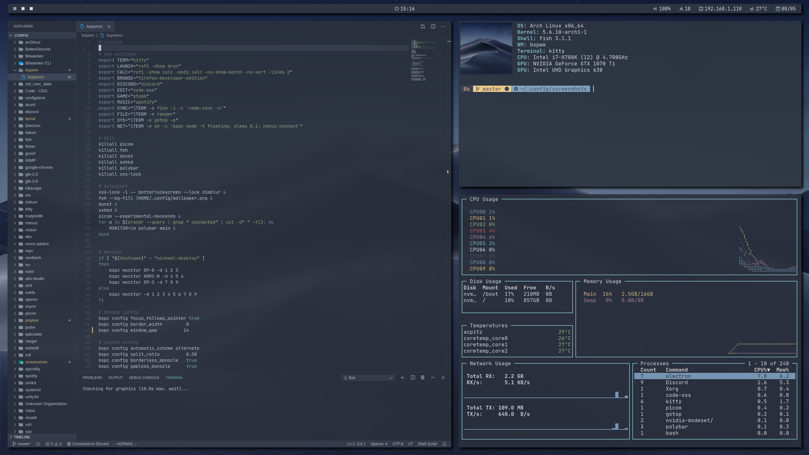

# **Dotfiles**
## Personal dotfiles for my Arch / BSPWM install.

---
## **Description**

This repo holds the configuration for most of my programs configured in the `~/.config` directory, including ones I no longer use. Just install the programs listed below, and clone the folders to your config directory. To get zsh to work you must link it to the config as shown below.

`ln -s ~/.config/zsh/zshrc ~/.zshrc`

---
## **Programs**

**Configured programs:**
- betterdiscord
- betterlockscreen
- bspwm
- cava
- code-oss
- dunst
- kitty
- picom
- polybar
- redshift
- rofi
- spicetify
- sxhkd
- yay
- zsh

 
**Additional programs used:**
- antibody
- feh
- firefox
- gotop
- mpv
- maim
- neofetch
- networkmanager
- nerd-fonts-jetbrains-mono
