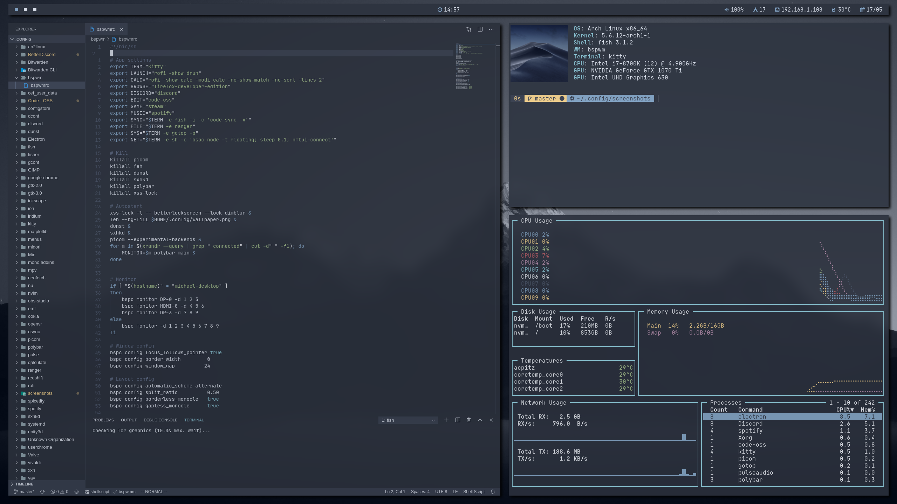

---
## **Description**

This repo holds the configuration for most of my programs configured in the `~/.config` directory. Just install the programs listed below, and clone the folders to your config directory. To get zsh to work you must link it to the config as shown below.

`ln -s ~/.config/zsh/zshrc ~/.zshrc`

---
## **Programs**

**Configured programs:**
- betterdiscord
- betterlockscreen
- bspwm
- cava
- code-oss
- dunst
- kitty
- neovim
- picom
- polybar
- ranger
- redshift
- rofi
- spicetify
- sxhkd
- yay
- zsh

 
**Additional programs used:**
- antibody
- feh
- firefox
- gotop
- mpv
- maim
- neofetch
- networkmanager
- nerd-fonts-jetbrains-mono
